- 👋 Hi, I’m Galo Pocoma
- 👀 I’m interested in data analytics, data visualization, web development with Django.
- 🌱 I’m currently learning Kubernetes and Android optimization.
- 💞️ I’m looking to collaborate on game development and data analysis.
- 📫 You can contact me by writing an email to gpocoma@msn.com. Also you can post issues in my projects.
<!---
Giotheasy/Giotheasy is a ✨ special ✨ repository because its `README.md` (this file) appears on your GitHub profile.
You can click the Preview link to take a look at your changes.
--->

```mermaid
graph TD
    subgraph Origen de Datos
        DB[Instancia EC2 - Base de Datos <img src='https://raw.githubusercontent.com/aws/aws-sdk-js-v3/main/codegen/sdk-codegen/src/main/resources/software/amazon/awssdk/codegen/sdkmodels/c2j/icons/Amazon-EC2_Instance_64.svg' width='40' height='40'>]
    end

    subgraph Procesamiento y Carga - AWS Lambda
        EB(AWS EventBridge - Programador <img src='https://raw.githubusercontent.com/aws/aws-sdk-js-v3/main/codegen/sdk-codegen/src/main/resources/software/amazon/awssdk/codegen/sdkmodels/c2j/icons/Amazon-EventBridge_64.svg' width='40' height='40'>) --> L(Función AWS Lambda <img src='https://raw.githubusercontent.com/aws/aws-sdk-js-v3/main/codegen/sdk-codegen/src/main/resources/software/amazon/awssdk/codegen/sdkmodels/c2j/icons/AWS-Lambda_Lambda-Function_64.svg' width='40' height='40'>)
    end

    subgraph Almacenamiento Centralizado - Amazon S3
        L --> S3_Bucket{Bucket de Amazon S3 <img src='https://upload.wikimedia.org/wikipedia/commons/thumb/9/93/Amazon_Web_Services_Logo.svg/2560px-Amazon_Web_Services_Logo.svg.png' width='40' height='40'>}
        S3_Bucket --> S3_Ventas(Prefijo S3: /ventas/año=AA/mes=MM <img src='https://upload.wikimedia.org/wikipedia/commons/2/23/Folder_font_awesome.svg' width='30' height='30'>)
        S3_Bucket --> S3_Finanzas(Prefijo S3: /finanzas/año=AA/mes=MM <img src='https://upload.wikimedia.org/wikipedia/commons/2/23/Folder_font_awesome.svg' width='30' height='30'>)
        S3_Bucket --> S3_Marketing(Prefijo S3: /marketing/año=AA/mes=MM <img src='https://upload.wikimedia.org/wikipedia/commons/2/23/Folder_font_awesome.svg' width='30' height='30'>)
        S3_Bucket --> S3_RRHH(Prefijo S3: /recursos_humanos/año=AA/mes=MM <img src='https://upload.wikimedia.org/wikipedia/commons/2/23/Folder_font_awesome.svg' width='30' height='30'>)
    end

    subgraph Consumo de Datos - Power BI
        PBI_Desktop[Power BI Desktop <img src='https://upload.wikimedia.org/wikipedia/commons/c/c9/Microsoft_Power_BI_Logo.svg' width='40' height='40'>] --> PBI_Service(Servicio Power BI <img src='https://upload.wikimedia.org/wikipedia/commons/c/c9/Microsoft_Power_BI_Logo.svg' width='40' height='40'>)
    end

    subgraph Seguridad y Accesos - AWS IAM
        IAM_Role_Lambda(Rol IAM para Lambda <img src='https://raw.githubusercontent.com/aws/aws-sdk-js-v3/main/codegen/sdk-codegen/src/main/resources/software/amazon/awssdk/codegen/sdkmodels/c2j/icons/IAM_64.svg' width='40' height='40'>) --> L
        IAM_User_Analista_Ventas(Usuario IAM: Analista de Ventas <img src='https://raw.githubusercontent.com/aws/aws-sdk-js-v3/main/codegen/sdk-codegen/src/main/resources/software/amazon/awssdk/codegen/sdkmodels/c2j/icons/IAM-User_64.svg' width='40' height='40'>)
        IAM_User_Analista_Finanzas(Usuario IAM: Analista de Finanzas <img src='https://raw.githubusercontent.com/aws/aws-sdk-js-v3/main/codegen/sdk-codegen/src/main/resources/software/amazon/awssdk/codegen/sdkmodels/c2j/icons/IAM-User_64.svg' width='40' height='40'>)
        IAM_User_Analista_Gerencial(Usuario IAM: Analista Gerencial <img src='https://raw.githubusercontent.com/aws/aws-sdk-js-v3/main/codegen/sdk-codegen/src/main/resources/software/amazon/awssdk/codegen/sdkmodels/c2j/icons/IAM-User_64.svg' width='40' height='40'>)
    end

    DB -- Conexión de Red (VPC) --> L
    L -- Escribe archivos raw (particionados por fecha y tipo) --> S3_Bucket

    PBI_Desktop -- Conexión directa a S3 (credenciales IAM) --> S3_Bucket
    PBI_Service -- Actualización Programada --> S3_Bucket

    IAM_User_Analista_Ventas -- Permisos de lectura (solo /ventas/*) --> S3_Ventas
    IAM_User_Analista_Finanzas -- Permisos de lectura (solo /finanzas/*) --> S3_Finanzas
    
    IAM_User_Analista_Gerencial -- Permisos de lectura (múltiples prefijos) --> S3_Bucket
```

